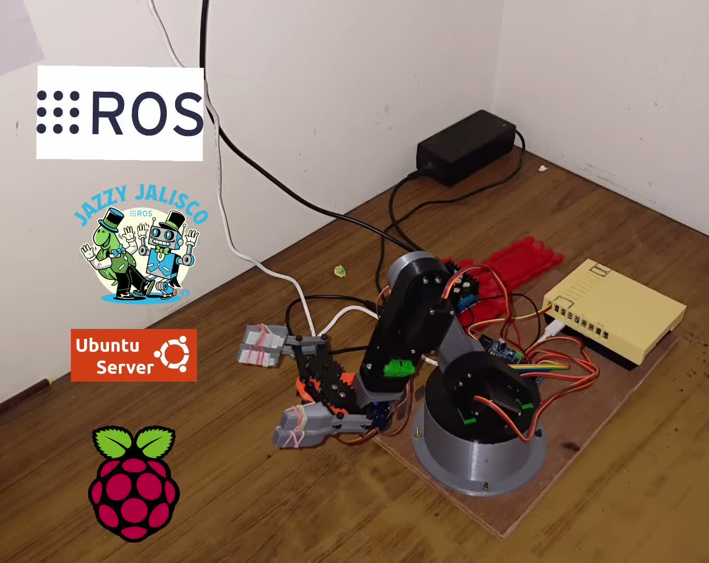

# 5DOF-manipulator- Raspberry-pi-5
A ROS 2-based robotic arm project using a Raspberry Pi 5, PCA9685 servo driver, MoveIt 2, RViz, and real hardware control.

## Project Overview

## Physical Robot Demonstration

Add an image of the physical robotic arm here:

```markdown

```

Add a GIF of the physical robot moving here:

```markdown

```

## RViz Demonstration

Add an image of the RViz setup here:

```markdown

```

Add a GIF showing manual planning and execution in RViz here:

```markdown

```

This project focuses on controlling a 5DOF robotic arm using ROS 2 Jazzy and a Raspberry Pi 5. The Raspberry Pi communicates with the servo motors through a PCA9685 PWM driver, while the laptop is used for MoveIt 2 motion planning and RViz visualization.

The project currently supports:

- Real-time control of the robotic arm servos
- ROS 2 hardware interface for the Raspberry Pi
- PCA9685-based PWM servo control
- MoveIt 2 motion planning
- RViz visualization and manual joint control
- Real hardware trajectory execution
- Gripper control
- Manual pick-and-place demonstration using a green ball
- Adjustable servo motion limits and hardware angle mapping

## System Architecture

```text
Laptop
├── MoveIt 2
├── RViz
├── Robot model and planning configuration
└── Motion planning and trajectory execution
             │
             │ ROS 2 communication
             ▼
Raspberry Pi 5
├── ROS 2 Jazzy
├── ros2_control hardware interface
├── Robotic arm hardware node
└── PCA9685 PWM servo driver
             │
             ▼
       Servo Motors
             │
             ▼
       5DOF Robotic Arm
```

## Hardware Used

- Raspberry Pi 5
- 5DOF robotic arm
- MG995 servo motors
- PCA9685 16-channel PWM servo driver
- External servo power supply
- Laptop running Pop!_OS
- Camera for future computer-vision integration
- Green ball for pick-and-place testing

## Software Used

- Ubuntu Server 24.04 on Raspberry Pi 5
- Pop!_OS on laptop
- ROS 2 Jazzy
- MoveIt 2
- RViz 2
- Gazebo
- C++17
- Python
- OpenCV — planned for the next stage
- Git and GitHub

## Repository Structure

```text
github_ws/
└── src/
    ├── robotic_arm_description/
    │   ├── urdf/
    │   ├── launch/
    │   └── config/
    │
    ├── robotic_arm_hardware/
    │   ├── src/
    │   ├── include/
    │   ├── CMakeLists.txt
    │   └── package.xml
    │
    └── robotic_arm_moveit/
        ├── config/
        ├── launch/
        └── package.xml
```

## Servo Channel Mapping

The current servo channel mapping is:

| Joint | Servo Channel | Function |
|---|---:|---|
| Joint 1 | 10 | Waist |
| Joint 2 | 11 | Shoulder |
| Joint 3 | 12 | Elbow |
| Joint 4 | 13 | Wrist pitch |
| Joint 5 | 14 | Wrist roll |
| Joint 6 | 15 | Gripper |

The servo angles are converted into ROS joint positions using the configured home angles, direction values, and angle limits.

## Servo Configuration

The current home-angle configuration is:

```cpp
home_angles_ = {
    110.0,
    110.0,
    10.0,
    110.0,
    110.0,
    110.0
};
```

The hardware interface also includes:

- Servo angle limits
- Servo direction correction
- Joint-position to servo-angle conversion
- Servo-angle to joint-position feedback conversion
- Incremental servo movement
- PCA9685 PWM output control

The servo movement step was adjusted to:

```cpp
constexpr double max_step_degrees = 7.5;
```

Trajectory limits were also adjusted in the controller configuration:

```yaml
max_velocity: 7.5
has_acceleration_limits: true
max_acceleration: 7.5
```

These values are being tested carefully because servo speed, power supply stability, mechanical load, and update frequency can affect vibration and smoothness.

## ROS 2 Workspace Setup

The working ROS 2 workspace is:

```bash
~/ros2_ws
```

Build the workspace using:

```bash
cd ~/ros2_ws
colcon build
source install/setup.bash
```

## Running the Real Hardware

On the Raspberry Pi:

```bash
source /opt/ros/jazzy/setup.bash
source ~/ros2_ws/install/setup.bash
ros2 launch robotic_arm_description real_hardware.launch.py
```

This starts the real hardware interface, robot state publisher, ros2_control, and the configured controllers.

## Running MoveIt and RViz

On the laptop:

```bash
source /opt/ros/jazzy/setup.bash
source ~/ros2_ws/install/setup.bash
ros2 launch robotic_arm_moveit moveit.launch.py
```

RViz can then be used to:

- View the robot model
- Move joints manually
- Set target poses
- Plan trajectories
- Execute trajectories on the real robotic arm
- Test gripper movement

## Current Achievements

### Real Hardware Control

The Raspberry Pi successfully controls the robotic arm servos through the PCA9685 PWM driver.

### ROS 2 Integration

The robotic arm is integrated with ROS 2 Jazzy using a custom hardware interface and ros2_control.

### MoveIt 2 Integration

MoveIt 2 successfully plans and executes trajectories on the real robotic arm.

### RViz Demonstration

The robot can be manually controlled and visualized in RViz while the planned movement is executed on the physical arm.

### Gripper Control

The gripper can be controlled through the configured gripper joint and mimic joint.

### Manual Pick-and-Place

The arm has been manually positioned to pick up and move a green ball using RViz and the real hardware.

## Media Folder

The recommended media structure is:

```text
github_ws/
├── README.md
├── images/
│   ├── physical_robot.jpg
│   ├── physical_robot_demo.gif
│   ├── rviz_demo.png
│   └── rviz_demo.gif
└── src/
    ├── robotic_arm_description/
    ├── robotic_arm_hardware/
    └── robotic_arm_moveit/
```

Create the images folder with:

```bash
mkdir -p ~/github_ws/images
```

Copy your images or GIFs into that folder and use the filenames referenced in this README.

## Future Work

- Automatic pick-and-place using a ROS 2 Python node
- Camera calibration
- Green-ball detection using OpenCV
- Pixel-to-world coordinate conversion
- TF2-based camera-to-robot transformations
- Automatic object localization
- Vision-guided grasping
- Multiple-object sorting
- Improved servo smoothing and vibration reduction
- Gazebo simulation of the complete robotic arm
- Integration of the robotic arm with a mobile robot

## Safety Notes

- Use an external power supply for the servos.
- Connect the Raspberry Pi ground and servo power-supply ground together.
- Keep the arm’s workspace clear during testing.
- Test new angle and speed limits gradually.
- Keep an emergency power cutoff accessible.
- Do not command the servos beyond their safe mechanical range.

## Author

**Ajay Bisht**

Robotics and Innovation Projects

