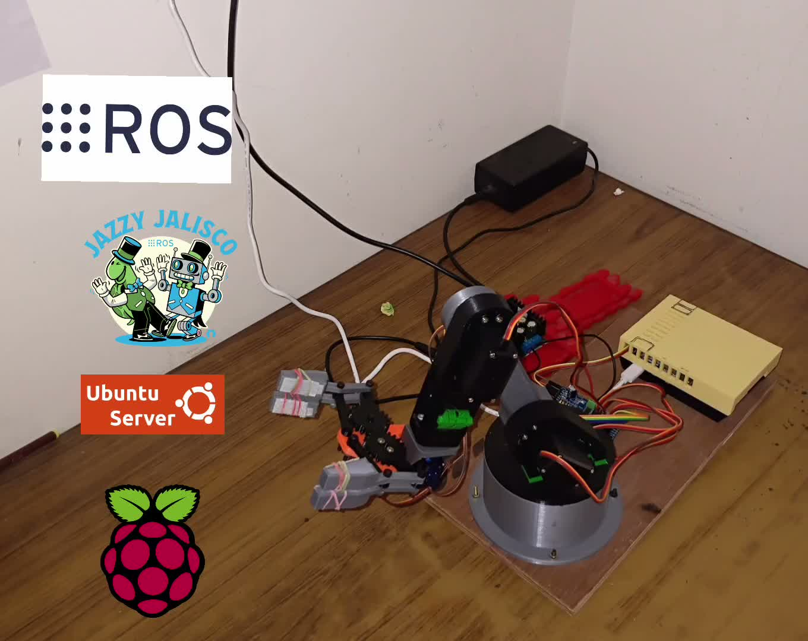
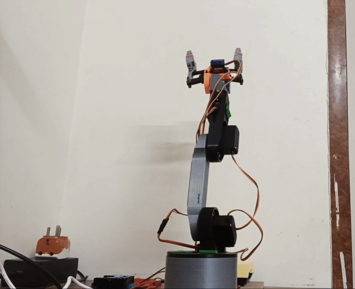
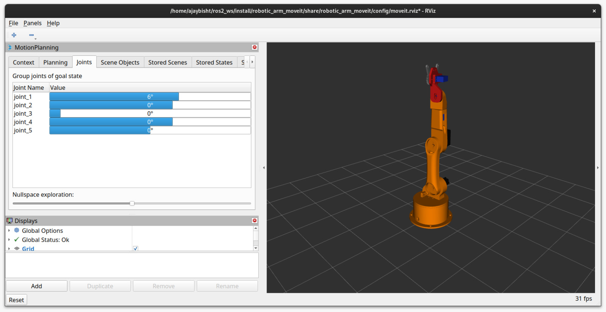
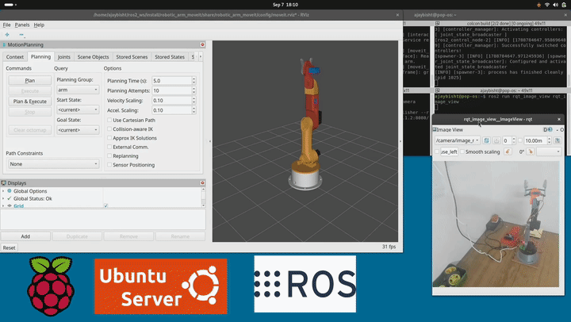
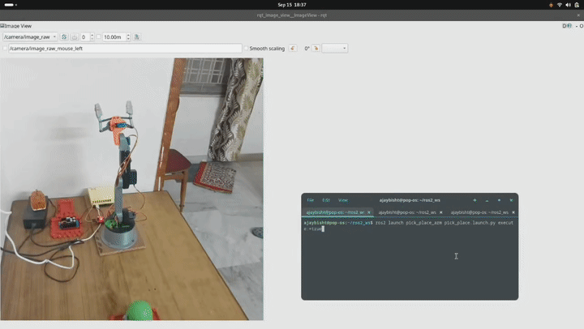

# 5-DOF Robotic Arm — ROS 2 MoveIt 2 Pick-and-Place

## Project Overview

This project implements a 5-DOF robotic arm using ROS 2 Jazzy, MoveIt 2, ros2_control, and real-hardware servo control. The system was developed to move the arm from a defined initial configuration, perform a pick operation, lift the object, move to a defined place position, release the object, and return to the required configuration.

The arm is controlled through MoveIt 2 motion planning, while ros2_control and the configured arm controller handle trajectory execution on the hardware.

## Main Components

- Raspberry Pi 5 / real robotic-arm hardware
- 5-DOF robotic arm
- ROS 2 Jazzy
- MoveIt 2
- ros2_control
- Joint trajectory controller
- Custom ROS 2 `pick_place_arm` package
- Custom `robotic_arm_description` package
- RViz for visualization and MoveIt planning

## ROS 2 Packages

### `robotic_arm_description`

Contains:

- URDF/Xacro robot description
- Servo and arm meshes
- ros2_control configuration
- Controller configuration
- Initial joint positions
- RViz configuration
- Real-hardware launch file

## Physical Robot Demonstration

<p align="left">
  
</p>

# Demo



## RViz Demonstration
<p align="left">
  
</p>

# Demo
| RViz Visualization & Pick and place demo |

|  |  |


### `pick_place_arm`

Contains the custom pick-and-place execution logic:

- `src/pick_place_node.cpp`
- `launch/pick_place.launch.py`
- `CMakeLists.txt`
- `package.xml`

The node uses MoveIt 2's `MoveGroupInterface` for the arm and gripper planning groups.

## Execution Sequence

The final setup uses two launch commands.

### Terminal 1 — Start the real hardware

```bash
ros2 launch robotic_arm_description real_hardware.launch.py
```

This starts the robot hardware interface and controllers.

### Terminal 2 — Start Pick and Place

```bash
ros2 launch pick_place_arm pick_place.launch.py execute:=true
```

This starts the custom pick-and-place node and enables trajectory execution.

Only these two launch commands are required for the final real-hardware execution. MoveIt should not be launched a second time separately because the pick-and-place launch already starts/uses the required MoveIt components.

## Pick-and-Place Motion Sequence

The custom node follows a structured sequence:

1. Move the arm to the initial position.
2. Move toward the pick position.
3. Lower the arm to the object.
4. Close the gripper.
5. Lift the arm.
6. Move toward the place position.
7. Lower/position the arm at the place location.
8. Open the gripper to release the object.
9. Return the arm to the required post-place configuration.

### Important Joint-2 Motion

A specific requirement of the motion sequence is that **only Joint 2 is moved to zero when the arm needs to lift after picking**.

The other joints should keep their required positions instead of being reset to zero.

After the lift operation, Joint 2 is returned to its configured/default value for the place-position movement.

This prevents the entire arm from unnecessarily moving to zero and gives the desired controlled pick → lift → place sequence.

## Motion Planning

MoveIt 2 uses the configured `arm` planning group and OMPL for motion planning.

The logs showed:

```text
Planner configuration 'arm' will use planner 'geometric::RRTConnect'
```

The planned trajectory is then sent to:

```text
arm_controller
```

The controller executes the generated joint trajectory on the real arm.

## Controller Execution

The execution chain is:

```text
Pick-and-Place Node
        |
        v
MoveGroupInterface
        |
        v
MoveIt 2
        |
        v
OMPL Motion Planner
        |
        v
Trajectory
        |
        v
arm_controller
        |
        v
ros2_control
        |
        v
Real Servo Hardware
```

## Important Problems Encountered

### 1. MoveIt Was Started Twice

One major execution problem came from launching MoveIt more than once.

The final solution is to use only:

```bash
ros2 launch robotic_arm_description real_hardware.launch.py
```

and:

```bash
ros2 launch pick_place_arm pick_place.launch.py execute:=true
```

Launching an additional MoveIt instance created conflicts and contributed to trajectory execution failures.

### 2. Initial Position Execution

The initial-position planning worked, but an earlier execution attempt showed:

```text
Controller handle arm_controller reports status PREEMPTED
```

and:

```text
MoveGroupInterface::execute() failed or timeout reached
```

The later execution log showed the controller successfully completing the trajectory:

```text
Controller 'arm_controller' successfully finished
```

and:

```text
Completed trajectory execution with status SUCCEEDED
```

This confirmed that the controller and MoveIt execution pipeline were capable of executing the planned trajectory successfully.

### 3. Joint-2 Lift Requirement

An important motion-planning correction was made so that the lift phase does not reset every joint.

The intended behavior is:

```text
PICK
  ↓
Close gripper
  ↓
Move Joint 2 → 0°
  ↓
LIFT
  ↓
Restore Joint 2 → place/default value
  ↓
Move to PLACE
  ↓
Open gripper
```

Only Joint 2 should change to zero during this specific lift step.

## Robot Description Warnings

MoveIt reported several links with visual geometry but no collision geometry, for example:

```text
elbow_servo_link
wrist_servo_link
arm03_servo_link
gripper_base_link
gripper_servo_link
gear_link
gear2_link
shoulder_servo_link
```

These warnings mean that those links do not currently have explicit collision geometry in the URDF.

For a more robust final system, collision meshes or primitive collision geometry should be added to these links.

## MoveIt / RViz Notes

RViz also produced messages such as:

```text
Action server: /recognize_objects not available
```

This is related to the optional object-recognition functionality and is not itself the core pick-and-place execution mechanism.

The important components for this project are the arm planning group, MoveIt motion planning, the gripper group, and the trajectory controller.

## Final Project Result

The project progressed from basic real-hardware arm control to a ROS 2 + MoveIt 2 based automated pick-and-place pipeline.

The system now has:

- A ROS 2 robot description
- ros2_control hardware interface
- MoveIt 2 planning
- OMPL/RRTConnect motion planning
- Arm trajectory execution
- Gripper control
- Custom pick-and-place node
- Initial-position handling
- Pick sequence
- Controlled Joint-2 lift
- Place sequence
- Release operation
- Real-hardware execution

## Future Development

The next planned stage is computer-vision-based object detection using a mobile-phone camera.

The planned architecture is:

```text
Mobile Phone Camera
        ↓
IP Webcam Stream
        ↓
ROS 2 Camera Publisher
        ↓
OpenCV Object Detection
        ↓
Object Pixel Coordinates
        ↓
Camera-to-Robot Coordinate Mapping
        ↓
Target Robot Position
        ↓
MoveIt 2 Motion Planning
        ↓
Pick and Place
```

This will allow the system to detect a ball even when its position changes and calculate a new robot target instead of relying on a fixed hard-coded pick position.

